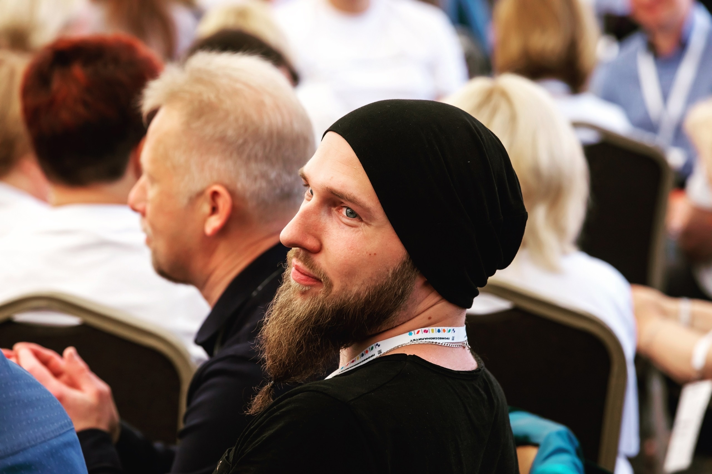
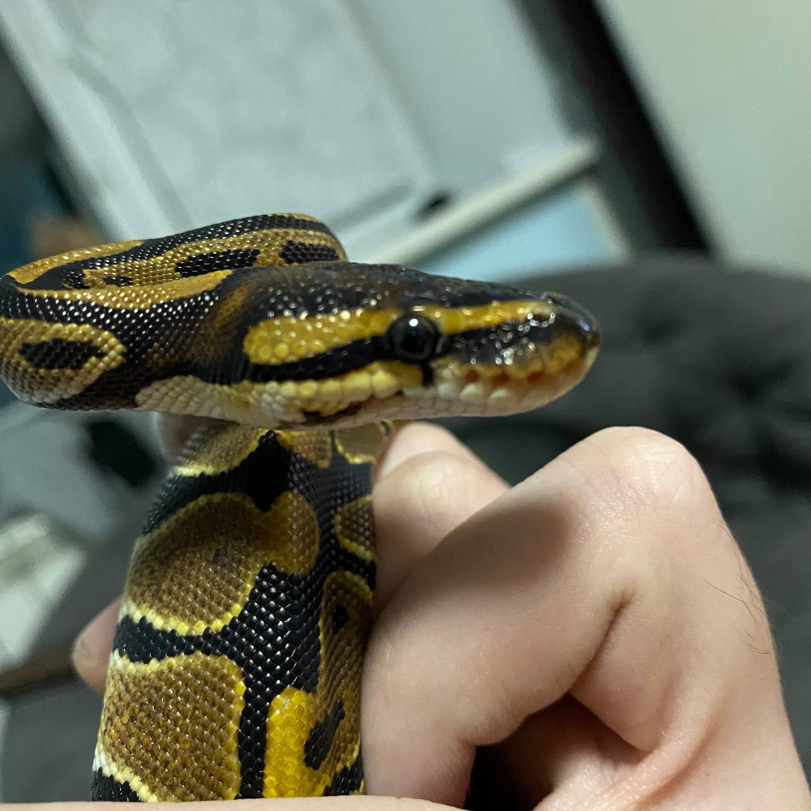

# Моя небольшая история
## Всем привет, меня зовут Евгений, мне 29 лет и будучи руководителем образовательно-производственного центра я решил научиться программированию!

Из **химика** в программисты - довольно волевое решение, да и возраст уже солидный, но я уверен, что это мне никак не помешает, ведь главное стремление и желание, а все остальное "наживное".

### Почему я выбрал именно python:
 - Довольно понятный синтаксис
 - Живу с королевским питоном (да, ест грызунов)
 - Огромное языковое сообщество

